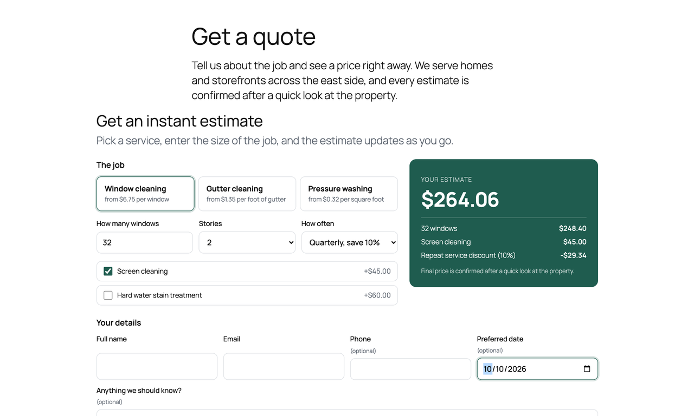
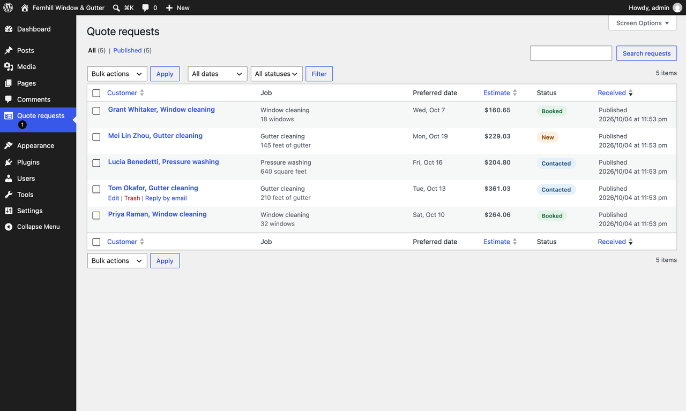
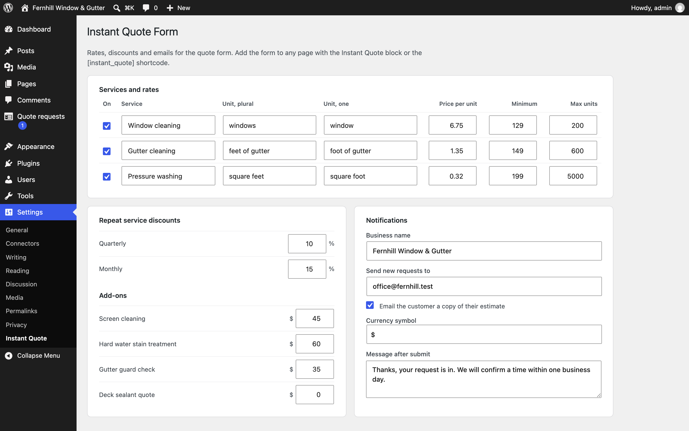

# Instant Quote Form (sample WordPress plugin)

A custom WordPress plugin for Fernhill Window & Gutter, a fictional cleaning company. Visitors pick a service, enter the size of the job and see a price estimate update as they type; sending the form stores the request under **Quote requests** in the admin with its estimate and a status, emails the business, and optionally sends the customer a copy. Rates, minimums, repeat-service discounts, add-ons and emails are all editable under **Settings, Instant Quote**.

It ships as an **Instant Quote** block (server-rendered, so the editor preview is the real form) and an `[instant_quote]` shortcode. Security is part of the build: a nonce on every submit, a honeypot, five requests an hour per connection, server-side recalculation of the estimate (a posted price is ignored), sanitized input and escaped output, `manage_options` on the settings page, nonce and capability checks on status changes, a private post type nobody can create by hand, and an uninstall that removes the settings, every request and the temporary data.

Try it with Docker and Node: `npm install && npm run env:start` brings up WordPress at http://localhost:8890 (admin / password) with the plugin active, `npm run test:setup && npm run test` runs the 23 PHPUnit tests inside wp-env (`docs/test-results.txt`), and `npm run zip` builds `dist/instant-quote-form.zip` for Plugins, Add New, Upload.

Fernhill is not a real company. This plugin was built by Ha Le as a demo, and all names and data in it are invented.

